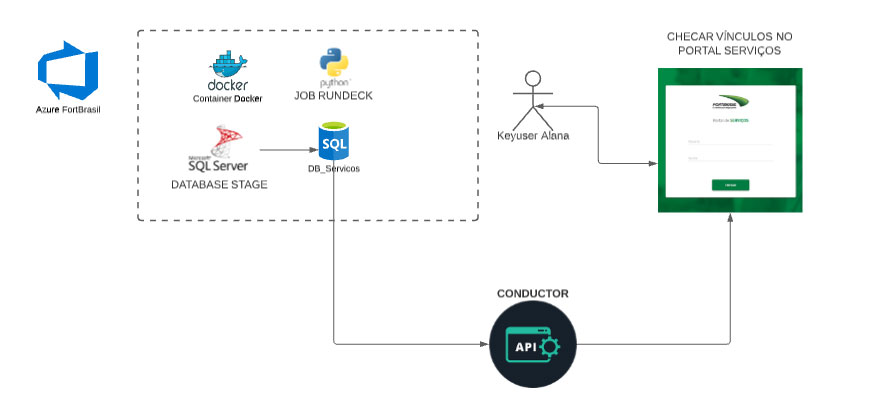

## Fluxo do Processo destes Jobs:

## Info:
## SQLServer
/src/services/db_sqlsrv

## MySQL
/src/services/db_mysql

## SCRIPTS - JOBS a serem rodados
## rodar as 16h
- Para pegar dados do stage e passar para o MySQL
    /src/procedimento_pegar_dados_stage_to_mysql

## rodar as 18h
- Para enviar para o pier através do MySQL
    /src/procedimento_enviar_para_pier

## comandos:
1 -  docker build -t job_operacoes .  
2 -  docker run job_operacoes procedimento_pegar_dados_stage_to_mysql.py 
3 -  docker run  job_operacoes procedimento_enviar_para_pier.py

## packages necessários:
aiohttp==3.7.4.post0 
async-timeout==3.0.1 
attrs==21.2.0 
azure-common==1.1.27 
azure-core==1.18.0 
azure-identity==1.6.0 
azure-keyvault-secrets==4.3.0 
azure-storage-file-share==12.5.0 
certifi==2021.5.30 
cffi==1.14.6 
chardet==4.0.0 
charset-normalizer==2.0.4 
cryptography==3.4.8 
idna==3.2 
isodate==0.6.0 
msal==1.14.0 
msal-extensions==0.3.0 
msrest==0.6.21 
multidict==5.1.0 
mysql-connector-python==8.0.26 
oauthlib==3.1.1 
portalocker==1.7.1 
protobuf==3.17.3 
pycparser==2.20 
PyJWT==2.1.0 
pyodbc==4.0.32 
requests==2.26.0 
requests-oauthlib==1.3.0 
six==1.16.0 
typing-extensions==3.10.0.2 
urllib3==1.26.6 
yarl==1.6.3
